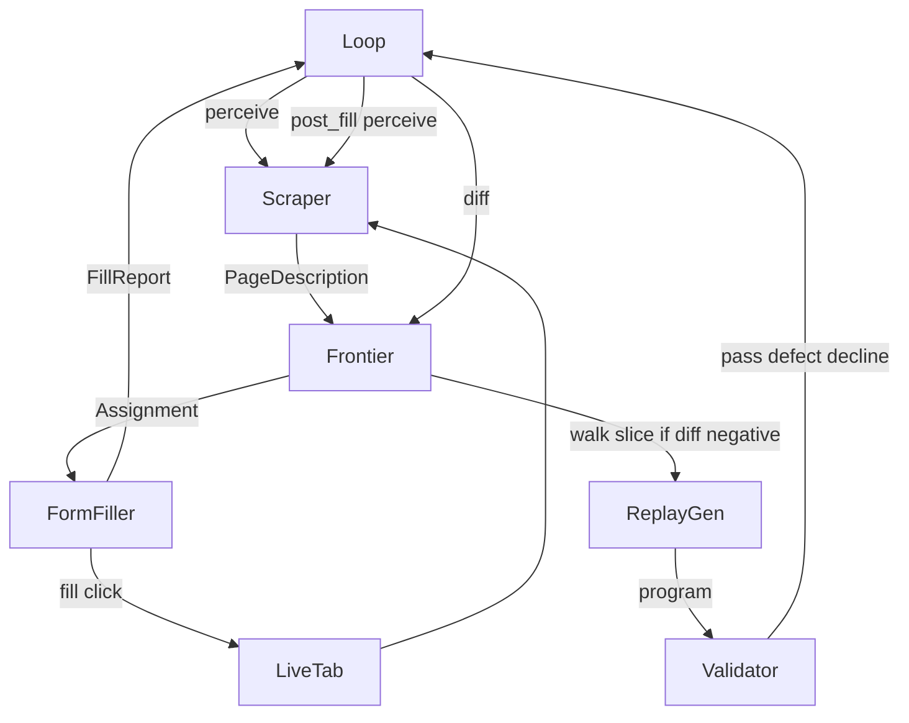

# Capture contracts



Loop is the orchestrator (not a sixth capture agent). Agents: scraper, frontier, form filler, replay gen, validator.

Illegal: scraper to filler; scraper to validator; filler to replay gen; frontier to scraper.

---

## Steps

1. Open the live tab. Login is page 1 of this same chain.
2. Loop asks Scraper to look. Scraper returns a PageDescription (below). Tree and snapshot refs are thrown away.
3. PageDescription goes to Frontier. Frontier updates the board and emits one Assignment.
4. Form filler runs that Assignment on the same tab (locator fill/click). Returns a Fill report to Loop. Filler does not pick the next assignment.
5. Loop asks Scraper to look again (post_fill). New PageDescription.
6. Loop diffs the two PageDescriptions by fieldId / locator. Result goes to Frontier.
7. If diff is +ve (page changed): Frontier adds new fields/options, emits the next Assignment, go to step 4.
8. If diff is −ve (page settled): Frontier sends the walk slice to Replay gen. Replay gen writes a program. Validator runs it with the lab fixture.
9. Validator: pass → Frontier’s next assignment (other option, Next, or stop). defect → patch the program, not the applicant, run Validator again. decline → stop, no patch.
10. After backtrack, drop fields that belonged only to the old option. Do not walk combinations of independent gates. Publish walk + program when Frontier says stop.

---

## Shapes

These are the payloads. Contracts below only name them.

**PageDescription** (Scraper output. What is on the page right now.)

```
{
  "stageId": "form_page_1_business_info",
  "url": "https://partner.pieinsurance.com/work-comp/business-info",
  "controls": [{
    "fieldId": "q_001",
    "label": "Agency / Program",
    "type": "other",
    "required": true,
    "options": null,
    "locator": "#agencyProgram",
    "unique": true,
    "revealedBy": null
  }],
  "next": "button:has-text(\"Next\")",
  "back": null,
  "candidateGates": [],
  "blockers": []
}
```

control type: text | select | toggle | date | number | other.
locator: Playwright address, unique, not a snapshot ref (e12).
options: the list of choices, not the chosen value.
revealedBy: { fieldId, equals } if this control appeared because of a gate.
candidateGates: controls that look like they branch.
blockers: validation text, overlays, decline chrome.

**Frontier board** (Frontier memory.)

```
{
  "gates": [{
    "gateId": "g_entity",
    "fieldId": "q_006",
    "stageId": "form_page_1_business_info",
    "kind": "same-page",
    "options": ["Limited Liability Company", "Corporation"],
    "walked": ["Limited Liability Company"],
    "pending": ["Corporation"]
  }],
  "currentStageId": "form_page_1_business_info",
  "status": "awaiting_fill"
}
```

status: exploring | awaiting_fill | slice_stable | advancing | backtracking | complete | blocked.

kind: same-page | last-page

**Assignment** (Frontier → Form filler. One thing to do.)

type: fill_page | set_option | fill_revealed | back | next | submit | last_page_optional_probe | stop.

```
{ "type": "set_option", "gateId": "g_entity", "option": "Corporation", "locator": "#entityType" }
{ "type": "fill_page", "applicantSlice": { "business.legal_name": "Harbor Point Bistro LLC" } }
{ "type": "next" }
{ "type": "stop" }
```

**Fill report** (Form filler → Loop.)

```
{
  "ok": true,
  "steps": [{
    "fieldId": "q_004",
    "action": "fill",
    "locator": "#businessName",
    "value": "Harbor Point Bistro LLC",
    "required": true
  }],
  "advance": false,
  "landed": ["q_004"]
}
```

action: fill | select | toggle | click | type.
errorClass if failed: not_found | not_unique | widget | validation.

**Diff** (Loop → Frontier. Two PageDescriptions compared.)

```
{
  "polarity": "+ve",
  "addedControls": [{ "label": "Members", "locator": "#llcMembers", "unique": true }],
  "removedControls": [],
  "changedControls": []
}
```

+ve = page changed. −ve = settled → Replay gen.

**Walk slice** (Frontier → Replay gen.) Ordered actions that landed: type | choose | toggle | click | wait-for | back. Each: fieldId, locator, canonical or credentialKey, option if a gate.

**Program** (Replay gen → Validator.)

```
{
  "language": "playwright-js",
  "ir": [
    { "action": "type", "locator": "#emailAddress", "valueFrom": "credential", "credentialKey": "LOGIN_EMAIL" },
    { "action": "click", "locator": "button[type=\"submit\"]" },
    { "action": "type", "locator": "#businessName", "valueFrom": "canonical", "canonical": "business.legal_name" }
  ]
}
```

May also be the RR replay .js file compiled from ir. Later: `node <script> <answers.json> [--config creds.json]`.

**Validator report**

outcome: pass | defect | decline | stuck.
decline: stop, no patch.
defect: patch program, applicant unchanged.

---

## Contracts

### Loop → Scraper

Look at this tab. Do not type. Do not see the applicant.

Request: job id, objective (perceive | post_fill).

Response: status + PageDescription.

Fail: snapshot failed, page not ready, locator not unique.

Then: PageDescription goes to Frontier.

### Scraper → Frontier

Here is the page. Update the board.

Request: job id + PageDescription.

Response: board updated, pending/walked, ready for one Assignment or slice_stable / blocked / complete.

Fail: missing locators, not unique, merge failed.

### Frontier → Form filler

Do this one Assignment. Filler does not choose the next branch.

Request: job id, stageId, Assignment (includes locator).

Response: Fill report.

Fail: not_found, not_unique, widget, validation, could not reach target.

Then: Loop scrapes if the page may have changed.

### Form filler → Loop

Same Fill report as above. Loop may scrape post_fill. Loop does not send this to Replay gen.

### Loop → Frontier

What changed (code, not a model).

Request: previous PageDescription, new PageDescription, last Assignment.

Response: Diff.

+ve: more fill, no Replay gen.
−ve: walk slice to Replay gen.
Backtrack: drop fields that belonged only to the old option.

Fail: missing description, cannot align locators.

### Frontier → Replay gen

Only if Diff is −ve.

Request: job id + walk slice.

Response: Program (locators only). Replay gen does not fill the portal.

Fail: slice missing locators, cannot compile.

### Replay gen → Validator

Run the program with the lab fixture. Patch defects. Do not patch decline. Applicant immutable. No a11y tree from Scraper.

Request: job id, Program, lab applicant, credentials.

Response: pass | defect (patched program) | decline | stuck.

### Validator → Loop

Same report. Loop/Frontier: pass → next; defect → keep applicant; decline → stop; stuck at capture may patch; at customer execute no patch, queue recapture.
